# event-driven-design

A learning monorepo exploring event-driven architecture patterns in TypeScript — SNS fan-out,
SQS dead-letter queues, EventBridge routing, and DynamoDB, developed locally against LocalStack.

---

## Projects

| Project | Description |
|---------|-------------|
| [campaign-fanout](campaign-fanout/) | Fan-out pattern: one SNS topic broadcasts campaign events to multiple independent SQS consumers |

---

## Architecture — campaign-fanout



**Colour guide**

| Colour | Meaning |
|--------|---------|
| Green | SQS standard queues |
| Purple | SNS FIFO / FIFO SQS queue |
| Orange-red | EventBridge bus and routed queues |
| Amber | Dead-letter queues |
| Blue | DynamoDB (shared idempotency store) |
| Pink | Module 8 additions (semaphore, rate limiter, AsyncLocalStorage) |

**Reading the diagram left → right**

1. **Publisher** (grey box, left) sends to three transports: SNS standard, SNS FIFO, and EventBridge.
2. **SNS standard** fans out to four queues — processor, analytics, audit, and notifier. The notifier subscription carries a filter policy so only paid-tier events (`pro` / `enterprise`) are enqueued.
3. **SNS FIFO** delivers to `campaign-email` with `MessageGroupId = campaignId`, guaranteeing per-campaign ordering. The email consumer uses DynamoDB for shared idempotency across replicas.
4. **EventBridge** (`campaign-bus`) applies content-based rules: `detail.campaignType = "survey"` → survey queue; `detail.audienceSize > 10000` → high-volume queue. A single event can match both rules simultaneously.
5. **BaseConsumer** (dashed box, top right) wraps every consumer with a **Semaphore** (per-tenant concurrency cap) and a **Rate limiter** (per-tenant token bucket). Both are opt-in via `ConsumerConfig`.
6. **DynamoDB** (shared, bottom right) holds the `IdempotencyKeys` table — a single `PutItem` with `attribute_not_exists(pk)` guards against duplicate processing across all consumer replicas.
7. **DLQ monitor** and **Replay script** (right column) are operational tooling: the monitor peeks without consuming; the replay script re-drives messages directly into the main queue (not through SNS, to avoid re-broadcasting).

---

## Quick Start

```bash
# 1. Start LocalStack
docker compose -f campaign-fanout/docker-compose.yml up -d

# 2. Install dependencies (once)
cd campaign-fanout && npm install

# 3. Provision all AWS resources
npm run infra:setup
```

`infra:setup` is idempotent — safe to re-run after any config change or LocalStack restart.

---

## Testing flows

All commands below are run from the `campaign-fanout/` directory.
Consumers run indefinitely; stop them with `Ctrl+C`.

---

### Flow 1 — SNS fan-out (standard topics)

Tests one publish reaching all subscribed SQS queues simultaneously.
Needs **4 terminals**.

```
Terminal 1 (keep running)   Terminal 2 (keep running)   Terminal 3 (keep running)
─────────────────────────   ─────────────────────────   ─────────────────────────
npm run consume             npm run consume:email        npm run consume:notification
# AnalyticsConsumer         # EmailConsumer              # NotificationConsumer
# campaign-analytics        # campaign-processor.fifo    # campaign-notifier
# all tiers                 # FIFO + DynamoDB idempotency# paid tiers only
```

Then in **Terminal 4**:

```bash
npm run publish         # one event — campaignType:email, tenantTier:pro, audienceSize:4200
# └─ Terminal 1: [AnalyticsConsumer] recording analytics event
# └─ Terminal 2: [EmailConsumer] sending email
# └─ Terminal 3: [NotificationConsumer] sending notification  (pro tier → passes filter)

npm run publish:batch   # 10 events — 4 free + 3 pro + 3 enterprise
# └─ Terminal 1: 10 analytics events
# └─ Terminal 2: 10 email events
# └─ Terminal 3: 6 events  (only pro + enterprise; free tier filtered by SNS)
```

**What to look for:**
- Terminal 3 receives fewer messages than Terminal 1/2 — SNS drops free-tier events at the broker before they enter the queue.
- Terminal 2 logs DynamoDB idempotency checks; re-running `publish` with the same `campaignId` produces `duplicate — skipping`.

---

### Flow 2 — EventBridge content-based routing

Tests body-field routing: `campaignType = "survey"` → survey queue; `audienceSize > 10000` → high-volume queue.
Needs **3 terminals**.

```
Terminal 1 (keep running)          Terminal 2 (keep running)
──────────────────────────────     ──────────────────────────────
npm run consume:survey             npm run consume:high-volume
# SurveyConsumer                   # HighVolumeConsumer
# campaign-survey                  # campaign-high-volume
# EB rule: campaignType="survey"   # EB rule: audienceSize>10000
```

Then in **Terminal 3**:

```bash
npm run eb:put
# Publishes two events to campaign-bus:
#   event 1: campaignType=survey,  audienceSize=500
#             └─ Terminal 1 only  (matches survey rule; audienceSize NOT >10000)
#   event 2: campaignType=email,   audienceSize=50000
#             └─ Terminal 2 only  (matches high-volume rule; campaignType NOT survey)
```

**Edge case to try:** edit `src/scripts/put-event.ts`, set `campaignType: "survey"` and `audienceSize: 15000` on the same event. Both terminals receive it — EventBridge rule independence means one event can match multiple rules simultaneously.

---

### Flow 3 — DLQ monitoring and replay

Tests dead-letter queue tooling. No separate consumer terminal needed.

```bash
# Terminal 1 — watch all DLQs continuously
npm run dlq:monitor
# Polls every 10 s; emits one JSON alert per message found:
# { "queue": "campaign-analytics-dlq", "messageId": "...", "body": {...} }

# Terminal 2 — replay a specific DLQ back into its main queue
npm run dlq:replay -- campaign-analytics-dlq
# Drains the DLQ, re-sends each message to campaign-analytics,
# adds replayedAt attribute to prevent infinite replay loops.
```

**How to put something in the DLQ for testing:**
Temporarily break a consumer (e.g. throw inside `processMessageBatch`), publish a few events, let `maxReceiveCount: 3` exhaust, then restore the consumer and replay.

---

### Flow 4 — Noisy-neighbour fairness simulation

Self-contained — creates its own queue, runs, and cleans up. **1 terminal only**.

```bash
npm run noisy-neighbour
```

What it does:
- Publishes **100 messages** for `tenant-a` and **10 each** for `tenant-b` / `tenant-c`, interleaved across 10 rounds so the queue is mixed.
- Consumes with `maxConcurrentPerTenant: 2` (semaphore) and `TenantRateLimiter(20 msg/s, burst 5)`.
- Logs a progress table every 2 seconds and a final per-tenant throughput report.

**Expected output shape:**
```
✓ tenant-b done — 10 msgs in 0.49 s (20.4 msg/s effective)
✓ tenant-c done — 10 msgs in 0.51 s (19.6 msg/s effective)
...
✓ tenant-a done — 100 msgs in 4.98 s (20.1 msg/s effective)

Tenant          Messages    Duration    Effective Rate  vs. limit
tenant-a             100      4.98 s      20.1 msg/s   100% of 20/s cap
tenant-b              10      0.49 s      20.4 msg/s   102% of 20/s cap
tenant-c              10      0.51 s      19.6 msg/s    98% of 20/s cap
```

All three tenants process at the same rate; `tenant-b` and `tenant-c` finish ~4.5 s before `tenant-a` despite sharing one queue.

---

### Full multi-terminal layout (all flows at once)

To run everything simultaneously, open **6 terminals**, all in `campaign-fanout/`:

| Terminal | Command | Purpose |
|----------|---------|---------|
| T1 | `npm run consume` | AnalyticsConsumer — SNS standard fan-out |
| T2 | `npm run consume:email` | EmailConsumer — FIFO queue + DynamoDB idempotency |
| T3 | `npm run consume:notification` | NotificationConsumer — paid tiers only |
| T4 | `npm run consume:survey` | SurveyConsumer — EventBridge survey rule |
| T5 | `npm run consume:high-volume` | HighVolumeConsumer — EventBridge high-volume rule |
| T6 | publish / eb:put / noisy-neighbour | fire events and observe T1–T5 |

**T6 commands and which terminals respond:**

```bash
npm run publish
# → T1 ✓  T2 ✓  T3 ✓ (pro/enterprise only)  T4 ✗  T5 ✗

npm run publish:batch
# → T1 ✓ (10)  T2 ✓ (10)  T3 ✓ (6, paid tiers)  T4 ✗  T5 ✗

npm run eb:put
# → T1 ✗  T2 ✗  T3 ✗  T4 ✓ (survey event)  T5 ✓ (high-volume event)

npm run noisy-neighbour
# → runs standalone; T1–T5 unaffected (uses its own ephemeral queue)
```

---

## All commands — campaign-fanout

```bash
# Infrastructure
docker compose up -d              # start LocalStack
docker compose down               # stop LocalStack
docker compose down -v            # stop and wipe LocalStack volume
npm run infra:setup               # provision all SNS/SQS/EB/DynamoDB resources (idempotent)

# Publishing (SNS)
npm run publish                   # one CampaignPublished event (standard topic)
npm run publish:batch             # 10 events with mixed tenant tiers

# Publishing (EventBridge)
npm run eb:put                    # two events to campaign-bus (survey + high-volume)

# Consuming — run each in its own terminal
npm run consume                   # AnalyticsConsumer   — campaign-analytics
npm run consume:email             # EmailConsumer       — campaign-processor.fifo (FIFO)
npm run consume:notification      # NotificationConsumer — campaign-notifier (paid tiers)
npm run consume:survey            # SurveyConsumer      — campaign-survey (EB routed)
npm run consume:high-volume       # HighVolumeConsumer  — campaign-high-volume (EB routed)

# DLQ tooling
npm run dlq:monitor               # watch all DLQs, emit JSON alerts
npm run dlq:replay -- <dlq-name>  # drain a DLQ back into its main queue

# Fairness simulation
npm run noisy-neighbour           # self-contained noisy-neighbour demo (creates own queue)

# Quality
npm test                          # vitest watch mode
npm run test -- --run             # vitest CI mode (single pass)
npx tsc --noEmit                  # type-check without emitting
```

---

## Resources

Architecture decisions, learnings, and business context live in [`resources/`](resources/):

| Path | Contents |
|------|----------|
| [resources/campaign-fanout/architecture.md](resources/campaign-fanout/architecture.md) | Infrastructure layout, service choices, design decisions |
| [resources/campaign-fanout/learnings.md](resources/campaign-fanout/learnings.md) | Key learnings, gotchas, TypeScript/SDK insights |
| [resources/campaign-fanout/business-context.md](resources/campaign-fanout/business-context.md) | Problem statement, use case, pros/cons |
| [campaign-fanout/docs/messaging-decision.md](campaign-fanout/docs/messaging-decision.md) | SNS vs SQS vs EventBridge vs Kinesis vs Kafka comparison |
| [campaign-fanout/docs/decision-tree.md](campaign-fanout/docs/decision-tree.md) | Decision tree: pick a service given rate, ordering, replay, routing requirements |

These files are updated on every `/commit`.
